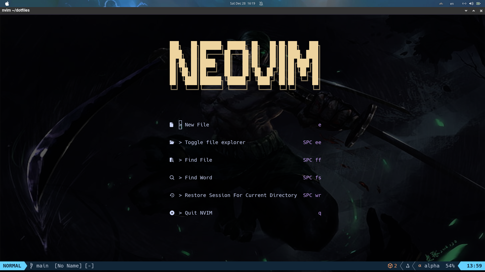
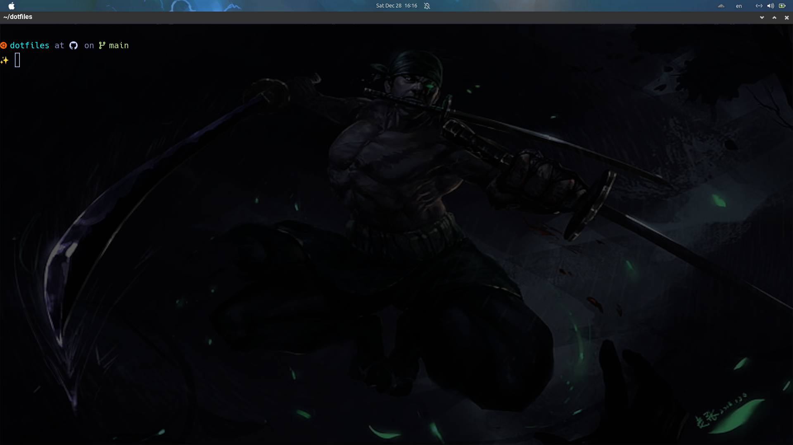
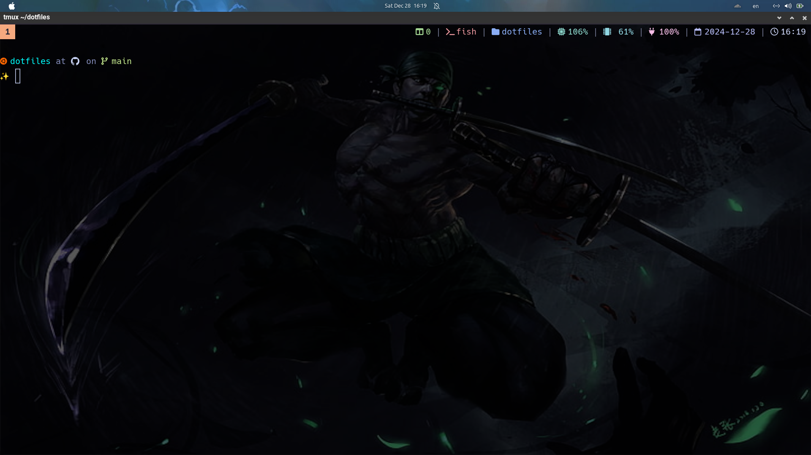

# Dotfiles Repository

This repository contains my personal configuration files (dotfiles) for tools and environments I use daily. These dotfiles are organized for efficient management using [GNU Stow](https://www.gnu.org/software/stow/).

## 📂 Repository Structure

The repository is organized as follows:

```plaintext
dotfiles/
├── tmux/
│   └── .tmux.conf
├── nvim/
│   └── .config/nvim/init.lua
├── git/
│   └── .gitconfig
├── fish/
│   └── .config/fish/config.fish
```

- **`tmux/`**: Configuration for [tmux](https://github.com/tmux/tmux).
- **`nvim/`**: Configuration for [Neovim](https://neovim.io/).
- **`git/`**: Global Git configurations.
- **`fish/`**: Configuration for [Fish](https://fishshell.com).

## 🛠️ Prerequisites

Before using these dotfiles, ensure the following tools are installed:

- Install HomeBrew

```
sudo apt update
sudo apt install build-essential curl file git -y
/bin/bash -c "$(curl -fsSL https://raw.githubusercontent.com/Homebrew/install/HEAD/install.sh)"
```

- Add PATH of Homebrew to bash shell

```
echo 'eval "$(/home/linuxbrew/.linuxbrew/bin/brew shellenv)"' >> ~/.bashrc
eval "$(/home/linuxbrew/.linuxbrew/bin/brew shellenv)"
```

- Install Nerd Font (Deafalt Use Hack Nerd Font)
```
git clone https://github.com/ryanoasis/nerd-fonts.git
cd nerd-fonts
./install.sh Hack
```


## 🚀 Installation

Follow these steps to set up your dotfiles:

### Clone the repository

```
git clone git@github.com:ThongVu1996/dotfiles.git ~/dotfiles
cd ~/dotfiles
```

- Install other application by BrewFile

```
brew bundle --file=Brewfile
```

- If you use wsl in Windown you must install wezterm in Window. Don't use wezterm installed by brew

- Create BrewFile (optional) to use in other PC

```
brew bundle dump --file=Brewfile
```

- Update Brewfile

```
brew bundle dump --force --file=Brewfile
```

- Use Fish Shell

```
echo /usr/bin/fish | sudo tee -a /etc/shells
chsh -s /usr/bin/fish
fish
```

- Copy config fish
```
cd ~/dotfiles/fish/.config/fish
cp config.fish  ~/.config/fish/config.fish
cd ~/dotfiles
source ~/.config/fish/config.fish
```

- Close and reopen terminal
### Apply configurations using GNU Stow

Run the following commands for the desired tools:

```
stow tmux
stow nvim
stow wezterm
```

This creates symlinks in your home directory, pointing to the respective configuration files in the repository.

### Remove configurations

If you want to remove a configuration, use:

```
stow -D <folder_name>
```

For example:

```
stow -D tmux
```

## 📋 Usage

### Add new configurations

1. Create a new folder in the `dotfiles` directory.
2. Add configuration files to the folder, mirroring the structure of `$HOME`.
3. Use `stow <folder_name>` to apply the new configuration.

### Update configurations

1. Edit the configuration files directly in the `dotfiles` repository.
2. Commit and push changes to the repository for backup.

## 🖼️ Screenshots

Here’s how my terminal looks after applying these configurations:

- **Neovim:**
  

- **Wezterm:**
  

- **Tmux:**
  

## ✨ Features

- Simplified dotfiles management using GNU Stow.
- Easy to customize and extend for other tools.
- Supports configurations for tmux, Neovim, Git, and Zsh.

## 📖 References

- [GNU Stow Documentation](https://www.gnu.org/software/stow/)
- [tmux GitHub Repository](https://github.com/tmux/tmux)
- [Neovim Documentation](https://neovim.io/)
- [Fish Documentation](https://fishshell.com/docs/current/index.html)

## 🤝 Contributing

Contributions are welcome! Feel free to fork this repository and submit a pull request with your improvements.

## 📒 Note

- If you are php backend dev:
  - Add .phpactor.json and other files generate in processing setting nvim to .git/info/exclude
- Force loading PHP lsp

```
LspStart phpactor
LspRestart
```

## 📝 License

This project is licensed under the MIT License. See the `LICENSE` file for details.
